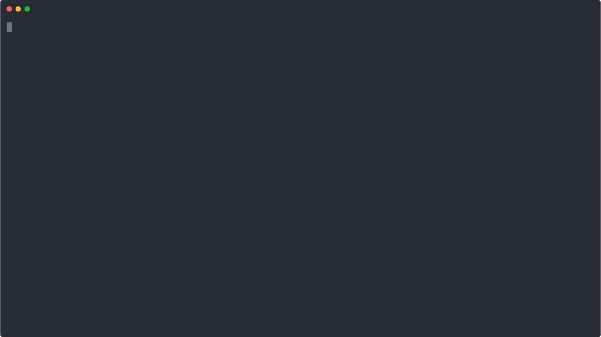

**goss** is a tool for managing AWS SSM parameters from the CLI. It was mainly developed to manage batches of secrets / parameters stored in local env files for application and infrastructure deployment.



## Contents
- [Contents](#contents)
- [Installation](#installation)
  - [Using go get](#using-go-get)
  - [Pre-built binaries](#pre-built-binaries)
- [Authentication](#authentication)
  - [Manual](#manual)
  - [Using aws-vault](#using-aws-vault)
- [Usage](#usage)
  - [List](#list)
    - [Default](#default)
    - [JSON](#json)
  - [Put](#put)
  - [Delete](#delete)
    - [Obligatory fancy jq pipe](#obligatory-fancy-jq-pipe)
  - [Import](#import)
    - [File format support](#file-format-support)
- [Why?](#why)
- [Acknowledgements](#acknowledgements)

## Installation
### Using go get
To install use `go get` with or without -u to have goss installed in your `$GOBIN`.
```
go get -u github.com/kevinglasson/goss
```
To remove after installing with `go get` run the following command - this will NOT remove the source code from `$GOPATH/src/...`
```
go clean -i github.com/kevinglasson/goss
```
### Pre-built binaries
Download the appropriate binary for your system from the [releases](https://github.com/kevinglasson/goss/releases) page.

## Authentication
### Manual
Authentication with AWS is pretty standard as this uses the AWS go SDK. More information can be found [here](https://docs.aws.amazon.com/sdk-for-go/v1/developer-guide/configuring-sdk.html). The gist of it is:

A region must be set in one of these ways:
- Set the `AWS_REGION` environment variable to the default Region
- Set the `AWS_SDK_LOAD_CONFIG` environment variable to true to get the Region value from the config file in the `.aws/config`

The places that the SDK looks for credentials are:
- Environment vairables
- Shared credentials file

### Using aws-vault
It is advised to use **goss** in conjuction with **aws-vault** so that your credentials are stored encrypted locally and you just inject them each time you run **goss**. E.g. to run with your 'prod' profile:
```bash
aws-vault exec prod -- goss
```

It may also be useful to alias this command in some useful way so that it isn't so painful to write out every time!
```bash
alias gprod='aws-vault exec prod -- goss'
```

If you are going to run multiple goss commands in a session you can start a shell that holds your credentials with:

```bash
# This will put your AWS credentials / region etc. into the environment
aws-vault exec prod -- bash

# Now proceed to use goss without the aws-vault prefix
goss list -p /
```

## Usage
```
goss is used to interact with the AWS SSM Parameter Store in a
variety of helpful ways.

You can interact in bulk through the 'import' sub-command to import parameters
directly from a local file.

You can also interact with paths individually to list, put and delete
parameters.

Usage:
  goss [command]

Available Commands:
  delete      Delete parameters
  help        Help about any command
  import      Import parameters from a file
  list        List parameters
  put         Put a parameter

Flags:
  -h, --help   help for goss
      --json   output as json

Use "goss [command] --help" for more information about a command.
```

### List
List all parameters at a given path, by default the output is a table with a subset of all of the fields AWS returns (the important ones).

- Parameters can be output as a JSON using the `--json` flag which facilitates interaction with other CLI tools such as **jq**.
- Parameters are returned encrypted by default, use the `-d` flag to have them decrypted.
- Parameters in sub-paths of the specified path are not returned by default, use the `-r` parameter to recursively list the parameters.

#### Default
```bash
goss list -p /dev/test-env -r
```
```md
+------------------------+--------------------------------------+---------+----------------------+
|          NAME          |                VALUE                 | VERSION |       LAST MOD       |
+------------------------+--------------------------------------+---------+----------------------+
| /dev/test-env/COMMENT  | AQICAHhEgSOjHIIiYIkJp/zSBm7c5cy7...¨ |       1 | 2020-09-19T03:35:10Z |
| /dev/test-env/MORE     | AQICAHhEgSOjHIIiYIkJp/zSBm7c5cy7...¨ |       1 | 2020-09-19T03:35:10Z |
| /dev/test-env/MiXeD    | AQICAHhEgSOjHIIiYIkJp/zSBm7c5cy7...¨ |       1 | 2020-09-19T03:35:09Z |
| /dev/test-env/UPPER    | AQICAHhEgSOjHIIiYIkJp/zSBm7c5cy7...¨ |       1 | 2020-09-19T03:35:09Z |
| /dev/test-env/lower    | AQICAHhEgSOjHIIiYIkJp/zSBm7c5cy7...¨ |       1 | 2020-09-19T03:35:09Z |
| /dev/test-env/oddChars | AQICAHhEgSOjHIIiYIkJp/zSBm7c5cy7...¨ |       1 | 2020-09-19T03:35:10Z |
+------------------------+--------------------------------------+---------+----------------------+
```
#### JSON
```bash
goss list -p /dev/test-env -r --json
```
```json
[
  {
    "ARN": "arn:aws:ssm:ap-southeast-2:XXXXXXXXXXXX:parameter/dev/test-env/COMMENT",
    "DataType": "text",
    "LastModifiedDate": "2020-09-19T03:35:10.111Z",
    "Name": "/dev/test-env/COMMENT",
    "Selector": null,
    "SourceResult": null,
    "Type": "SecureString",
    "Value": "AQICAHhEgSOjHIIiYIkJp/zSBm7c5cy7...",
    "Version": 1
  },
  //...
]

```

### Put
Put a single named parameter into the store. Note that the name, `-n` is the full path to the parameter.

```
goss put -n /test/param -v somevalue -t SecureString
```

### Delete
Delete a single named parameter from the store. Note that the name, `-n` is the full path to the parameter.
```bash
goss delete -n /test/param
```

#### Obligatory fancy jq pipe
Just some fanciness showing interop with other Unix tools, such as the popular **jq**. This will use **goss** to list the parameters in the store, output as json, filter to the names and pass them to **goss** again to delete.

```bash
goss list -p / --json | jq '.[].Name' | xargs -n1 -- goss delete -n
```
### Import
Import allows reading a file into the parameter store.

- All parameters from the file must be stored as the same type i.e. String or SecretString etc.
- Currently only `dotenv` key-value style files are supported. **However** the parsers are already accessible in the code for the other 3 major formats - I just need create a flag to allow a choice of input format.

```bash
goss import -f test.env -p /envs/dev -t SecureString
```

#### File format support
| File format | Currently supported |
| :---------: | ------------------- |
|   dotenv    | yes                 |
|    json     | soon!               |
|    toml     | soon!               |
|    yaml     | soon!               |

## Why?
I made this tool because although **chamber** is an excellent tool - it uses **viper** underneath and the problem with **viper** is that the keys are **CASE INSENSITIVE** which for me was unacceptable. So I decided to *roll-my-own* using the wonderful [**koanf**](https://github.com/knadh/koanf) library to manage the deserialisation of various config files.

## Acknowledgements
- [koanf](https://github.com/knadh/koanf): For being the solution to the problems I had.
- [chamber](https://github.com/segmentio/chamber): For being the inspiration.
- [cobra](https://github.com/spf13/cobra): For being an awesome CLI tool library.

[Buy me a ☕!](https://www.paypal.me/kevinglasson)